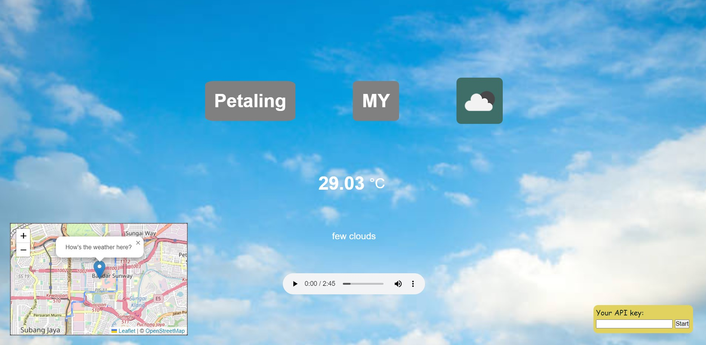

# **Weather App**
A web app that shows the weather based on user's current location or a specific location pinpointed on the map. Built using vanilla JavaScript with the help of ChatGPT. Created as my personal side project. 

## **Steps**
In order to use this app, you will have to obtain your own API key by registrating an account on [OpenWeatherMap](https://openweathermap.org/). The API key will be available for use within a few hours after registration. The API key is needed to authenticate and authorize access to the API used in this application. There are 2 alternatives on how to use your API key.

### ~ Method A  (Cloning this repository)
1. Clone this repository into your local repository.
2. In the weather.js file,
    - uncomment the code `useApi(lat, long);` on line 23 & 
    - comment out the code `retrieveApi();` on line 26.
3. Replace the `${API_KEY}` for the API reference link with your own API key in the useApi() function on line 44 of weather.js file. For example:
    - `const api = https://api.openweathermap.org/data/2.5/weather?lat=${lat}&lon=${long}&appid=1c456f1234b547c9999a294452546d10&units=metric;`
4. Open the index.html file in your browser. 

### ~ Method B  (Use the published website)
1. The website is hosted here [WeatherApp](https://waikittt.github.io/Weather-App/). Click on the link and open the website.
2. Submit your API key using the input field at the bottom right corner.
  

- - - 
- **NOTE**: Please refresh the page if the weather cannot be retrieved from a certain location and try selecting that location again :)   
- The webpage will look like this ⬇ ⬇   

## **Credits**
This project was built by utilizing the following resources:

- Tutorial video by developedbyed ([Build A Weather App With Vanilla Javascript Tutorial](https://www.youtube.com/watch?v=wPElVpR1rwA)).
- Weather API and icons from OpenWeatherMap.
- Interactive map from the Leaflet library.
- Music by [SoundsForYou](https://pixabay.com/users/soundsforyou-4861230/?utm_source=link-attribution&amp;utm_medium=referral&amp;utm_campaign=music&amp;utm_content=114484) from [Pixabay](https://pixabay.com/music//?utm_source=link-attribution&amp;utm_medium=referral&amp;utm_campaign=music&amp;utm_content=114484).
- Tile layer by [OpenStreetMap](https://www.openstreetmap.org/copyright).

